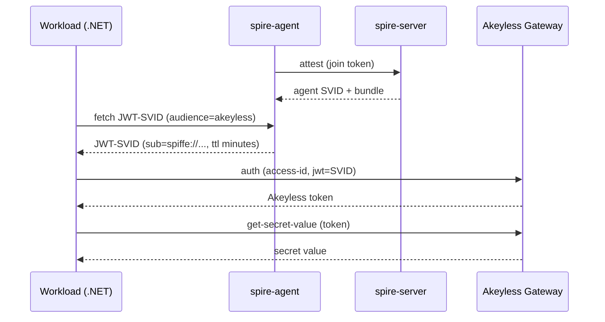

# Runtime Authentication to Akeyless with SPIFFE / SPIRE

A runnable reference for authenticating an on-premises workload to Akeyless with a SPIRE-issued JWT-SVID and reading a secret. The workload holds no credential of any kind. On each run it fetches a fresh SVID from the SPIRE Workload API, exchanges it for an Akeyless token, and reads the secret.

> New to SPIFFE or SPIRE? Start with the [runbooks](runbooks/), a beginner series covering concepts, setup, deployment, and troubleshooting. This README is the overview; the runbooks carry the depth.

## Why use this

- Zero secret material on the host: no token file, no API key at rest.
- Workloads attest instead of carrying credentials.
- Short-lived, audience-bound identities that expire on their own.
- Replays after expiry fail and are recorded in the Akeyless audit log.
- Authority scoped to a single secret path by a role bound to the SPIFFE ID.

## How it works



SPIRE attests the workload and issues it a short-lived JWT-SVID. The workload trades the SVID for an Akeyless token and reads the secret with it. The SVID exists only in memory for the call. For what each piece is and why it exists, see [Concepts you need first](runbooks/01-concepts.md).

## Alternatives

This repo is the SPIFFE/SPIRE counterpart to [akeyless-uid-runtime-auth](https://github.com/Fahmy-Kadiri-akl/akeyless-uid-runtime-auth), which solves the same problem with Akeyless Universal Identity.

| Concern | Universal Identity | SPIFFE / SPIRE |
|---|---|---|
| Credential on the host | A token file, rotated every few minutes | None. The SVID lives only in memory for the call. |
| Rotation mechanism | A systemd timer you install and operate | The SPIRE Workload API, at fetch time |
| Bootstrap material | One admin-generated token planted on the host | None. The workload is attested by SPIRE selectors. |
| Operational dependencies | Akeyless only | SPIRE server and agent, plus Akeyless |
| Best when | You want rotation without deploying SPIRE | You can run SPIRE and want zero on-disk credentials |

## Prerequisites

- Docker with the Compose v2 plugin. Verify with `docker compose version`.
- The Akeyless CLI on the admin host, used to mint a token and run the bootstrap.
- A short-lived Akeyless token starting with `t-`, with permission to create auth methods, roles, and secrets.
- Your Akeyless API gateway URL, reachable from the host running the app.
- Python 3, only if you run `bootstrap/verify-svid.sh`.

For install commands, token minting, and the exact capabilities the token needs, see [Prerequisites](runbooks/02-prerequisites.md).

## Quick start

Run every command from the repository root. [Runbook 03](runbooks/03-quick-start.md) walks through the same steps with full explanations.

### 1. Clone

```bash
git clone https://github.com/Fahmy-Kadiri-akl/akeyless-spiffe-runtime-auth.git
cd akeyless-spiffe-runtime-auth
```

### 2. Configure

```bash
cp spire/spire.env.example .env
```

Edit `.env` and set two values. The bootstrap generates the demo secret in Akeyless, so nothing else is required.

```
AKEYLESS_GATEWAY=https://your-account.akeyless.cloud/api/v2
AKEYLESS_TOKEN=<your-temp-token-from-akeyless-auth>
```

### 3. Start SPIRE

```bash
./spire/up.sh
```

Expected: the script ends with `==> SPIRE is up.`

### 4. Wire Akeyless

```bash
./bootstrap/setup-akeyless.sh
```

Expected: the script ends with `[setup] done.`

### 5. Read the secret

```bash
docker compose --project-directory . -f spire/docker-compose.yml exec host \
  dotnet /app/bin/Release/net8.0/secret-consumer.dll
```

Expected output:

```
[1/3] Fetching JWT-SVID (audience=akeyless) from /tmp/spire-agent/public/api.sock ...
      got SVID (330 bytes), sub=spiffe://example.org/ns/default/sa/secret-consumer, exp=...
[2/3] Authenticating to Akeyless at https://your-account.akeyless.cloud/api/v2/auth ...
      got Akeyless token (35 bytes)
[3/3] Reading secret /spiffe/demo/db-password ...
      secret value: spiffe-demo-<timestamp>
```

Re-run the command any time. Each run fetches a fresh SVID.

### Tear down

```bash
./spire/down.sh
```

If a step fails, find the matching error in [Troubleshooting](runbooks/07-troubleshooting.md).

## Where to go next

| Goal | Guide |
|---|---|
| Understand SPIFFE, SPIRE, SVIDs, and trust domains | [Concepts](runbooks/01-concepts.md) |
| Verify your environment and permissions | [Prerequisites](runbooks/02-prerequisites.md) |
| The quick start with full explanations | [Quick start runbook](runbooks/03-quick-start.md) |
| Run an agent for your own app, host, or language | [Deploying agents](runbooks/04-deploying-agents.md) |
| Change trust domain, TTLs, gateway, or paths | [Configuration reference](runbooks/05-configuration.md) |
| Move from the demo to production | [Production hardening](runbooks/06-production.md) |
| Diagnose a failure | [Troubleshooting](runbooks/07-troubleshooting.md) |

## Security model

No credential is written to disk. The SVID lives only in memory for the call, is short-lived and audience-bound, and replaying it after expiry fails and is recorded in the Akeyless audit log. The workload's authority comes from the Akeyless role bound to its SPIFFE ID, not from the SVID itself.

A compromised host is not stopped in real time: an attacker running code as the workload's UID can fetch valid SVIDs for as long as they hold that position. The defense is detection and revocation. For the full model and its limits, see [Security model and limitations](runbooks/06-production.md#security-model-and-limitations).

## Repository layout

```
spire/                         dev SPIRE topology and orchestration
  docker-compose.yml           spire-server and host services
  server.conf                  dev trust domain, self-signed CA
  agent.conf                   Workload API socket, bootstrap
  Dockerfile.host              .NET 8 SDK with spire-agent and the .NET reference app
  up.sh / down.sh              start and tear down the stack
  register-workload.sh         register the workload by Unix UID
  spire.env.example            template for .env
bootstrap/                     one-time Akeyless wiring
  setup-akeyless.sh            create auth method, role, demo secret
  spiffe-bundle-to-jwks.py     convert the SPIRE bundle into a JWKS
  verify-svid.sh               decode and validate a JWT-SVID
agent/                         portable, app-agnostic SPIRE agent
  Dockerfile.agent             slim agent image, no application
  agent-entrypoint.sh          renders agent config from env, runs the agent
  deploy-agent.sh              deploy the agent on a workload host
app/                           .NET 8 reference workload
  Program.cs                   fetch SVID, authenticate, read secret
  SecretConsumer.csproj
runbooks/                      beginner guides: concepts, setup, deployment, troubleshooting
```

## License

MIT.
