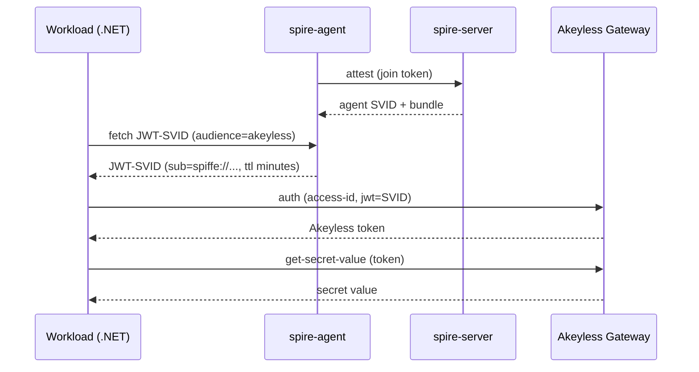
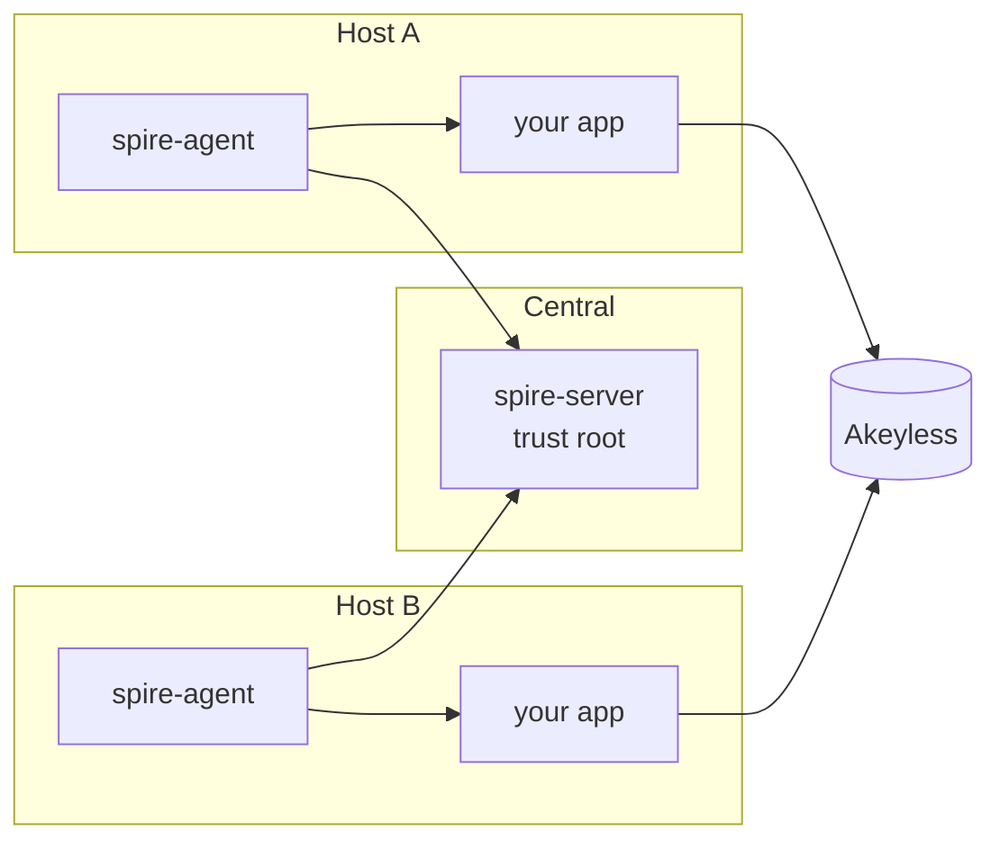

# Runtime Authentication to Akeyless with SPIFFE / SPIRE

> New to SPIFFE or SPIRE? Start with the [runbooks](runbooks/), a beginner
> series covering concepts, setup, deployment, and troubleshooting. This README
> is the framework; the runbooks carry the depth.

## What is this?

A runnable reference for authenticating an on-premises workload to Akeyless with a SPIRE-issued JWT-SVID and reading a secret. The workload holds no credential of any kind. On each run it fetches a fresh SVID from the SPIRE Workload API, exchanges it for an Akeyless token, and reads the secret.

## Why would I use this?

- Zero secret material on the host: no token file, no API key at rest.
- Workloads attest instead of carrying credentials.
- Short-lived, audience-bound identities that expire on their own.
- Replays after expiry fail and are recorded in the Akeyless audit log.
- Authority scoped to a single secret path by a role bound to the SPIFFE ID.

## How is this different?

| Concern | Universal Identity | SPIFFE / SPIRE |
|---|---|---|
| Credential on the host | A token file, rotated every few minutes | None. The SVID lives only in memory for the call. |
| Rotation mechanism | A systemd timer you install and operate | The SPIRE Workload API, at fetch time |
| Bootstrap material | One admin-generated token planted on the host | None. The workload is attested by SPIRE selectors. |
| Operational dependencies | Akeyless only | SPIRE server and agent, plus Akeyless |
| Best when | You want rotation without deploying SPIRE | You can run SPIRE and want zero on-disk credentials |

## Architecture



1. A dev `spire-server` and `spire-agent` run in Docker. The agent attests to the server once with a join token, then serves the Workload API on a local socket.
2. An admin registers the workload by Unix UID and binds it to a SPIFFE ID.
3. The bootstrap wires the SPIRE trust bundle into an Akeyless OAuth2/JWT auth method and a least-privilege role.
4. The workload fetches a JWT-SVID from the Workload API, trades it for an Akeyless token, and reads the secret.

## Prerequisites

- Docker with the Compose v2 plugin. Verify with `docker compose version`.
- The Akeyless CLI on the admin host, used to mint a token and run the bootstrap.
- A short-lived Akeyless token starting with `t-`, with permission to create auth methods, roles, and secrets. Mint it with `akeyless auth` and put it in `AKEYLESS_TOKEN`.
- Your Akeyless API gateway URL, reachable from the host running the app.
- Python 3, only if you run `bootstrap/verify-svid.sh`.

## Quick Start

Run every command from the repository root.

### 1. Clone

```bash
git clone https://github.com/Fahmy-Kadiri-akl/akeyless-spiffe-runtime-auth.git
cd akeyless-spiffe-runtime-auth
```

**Expected:** a local checkout of the repo.
**Why:** the host image and scripts run from this source.

### 2. Configure

```bash
cp spire/spire.env.example .env
```

Edit `.env`:

```
AKEYLESS_GATEWAY=https://your-account.akeyless.cloud/api/v2
AKEYLESS_TOKEN=<your-temp-token-from-akeyless-auth>
```

**Expected:** a `.env` with the gateway and token set.
**Why:** every later command reads the gateway and token from `.env`, so nothing is hardcoded.

> [!TIP]
> The demo secret lives only in Akeyless, generated there by the bootstrap. In a real deployment you provision your own secret in Akeyless and point `AKEYLESS_SECRET` at it; the app reads it at runtime from Akeyless.

### 3. Start SPIRE

```bash
./spire/up.sh
```

**Expected:** the script ends with `==> SPIRE is up.`
**Why:** the agent must be attesting and issuing SVIDs before Akeyless is wired. The host image is pulled pre-built from GHCR.

### 4. Wire Akeyless

```bash
./bootstrap/setup-akeyless.sh
```

**Expected:** the script ends with `[setup] done.`
**Why:** the workload can authenticate only after the auth method and role exist.

### 5. Read the secret

```bash
docker compose --project-directory . -f spire/docker-compose.yml exec host \
  dotnet /app/bin/Release/net8.0/secret-consumer.dll
```

**Expected:**

```
[1/3] Fetching JWT-SVID ... got SVID (330 bytes), sub=spiffe://example.org/ns/default/sa/secret-consumer
[2/3] Authenticating to Akeyless ... got Akeyless token (35 bytes)
[3/3] Reading secret /spiffe/demo/db-password ... secret value: spiffe-demo-<timestamp>
```

**Why:** this proves the SVID was accepted and the role granted read access. The app fetches the SVID from the Workload API, then calls the Akeyless REST API directly with `HttpClient` to authenticate and read the secret. Re-run any time; each run fetches a fresh SVID.

> [!TIP]
> The reference app calls the Akeyless REST API directly. For the full API surface, see the [Akeyless Postman collection](https://github.com/Fahmy-Kadiri-akl/akeyless-postman-collection), which documents `/api/v2/auth`, `/api/v2/get-secret-value`, and the rest of the v2 endpoints.

### Tear down

```bash
./spire/down.sh
```

## Repository Layout

```
spire/                         dev SPIRE topology and orchestration
  docker-compose.yml           spire-server and host services
  server.conf                  dev trust domain, self-signed CA
  agent.conf                   Workload API socket, bootstrap
  Dockerfile.host              .NET 8 SDK with spire-agent and the .NET reference app
  up.sh / down.sh              start and tear down the stack
  register-workload.sh         register the workload by Unix UID
  spire.env.example            template for .env
bootstrap/                     one-time Akeyless wiring
  setup-akeyless.sh            create auth method, role, demo secret
  spiffe-bundle-to-jwks.py     convert the SPIRE bundle into a JWKS
  verify-svid.sh               decode and validate a JWT-SVID
agent/                         portable, app-agnostic SPIRE agent
  Dockerfile.agent             slim agent image, no application
  agent-entrypoint.sh          renders agent config from env, runs the agent
  deploy-agent.sh              deploy the agent on a workload host
app/                           .NET 8 reference workload
  Program.cs                   fetch SVID, authenticate, read secret
  SecretConsumer.csproj
runbooks/                      beginner guides: concepts, setup, deployment, troubleshooting
```

## Security Model

- No credential is written to disk. The SVID exists only in memory for the call.
- The SVID is short-lived and audience-bound. A captured SVID is useless after it expires.
- Replaying an expired SVID fails authentication and is recorded in the Akeyless audit log.
- The workload's authority comes from the Akeyless role bound to its SPIFFE ID, not from the SVID itself.

> [!WARNING]
> A compromised host is not stopped in real time. An attacker who runs code as the workload's UID can fetch valid SVIDs and secrets for as long as they hold that position. The defense is detection and revocation, which the short SVID lifetime and audit log make possible.

## Production Considerations

The demo runs the server, agent, and app in one container. Production splits them across your fleet: one central `spire-server`, and a `spire-agent` on every host that runs a workload.



- **Trust root.** Make Akeyless the upstream authority so it signs SPIRE's CA. Setup: the gateway URL must include `/api/v2`, self-signed gateways need `custom_ca_bundle`, and the PKI issuer's allowed URI SANs must include the trust-domain root.
- **Bundle distribution.** Set `SPIRE_BUNDLE_ENDPOINT` to a public bundle endpoint so Akeyless tracks key rotation instead of using the inline JWKS.
- **Workload selectors.** The demo registers by `unix:uid:0`, which is broad. Use a dedicated UID, a process path, or the docker attestor with image or label selectors.
- **Agent bootstrap.** `insecure_bootstrap = true` is dev only. Distribute the server bundle and bootstrap over TLS.

For the full production guide, see [runbooks/06-production.md](runbooks/06-production.md).

## Troubleshooting

**Problem:** the `host` container exits with `JOIN_TOKEN is required`.
**Cause:** the stack was started with `docker compose up` instead of `up.sh`.
**Fix:** always start with `./spire/up.sh`, which mints the token and writes it to `.env`.

**Problem:** `auth` fails with an authorization error.
**Cause:** the SVID's `sub` does not match the role association, or the auth method's JWKS is stale after a trust-root change.
**Fix:** confirm `WORKLOAD_SPIFFE_ID` matches the registration, and re-run `./bootstrap/setup-akeyless.sh` to refresh the bundle.

**Problem:** `auth` fails with a TLS or certificate error.
**Cause:** the gateway uses a certificate the client does not trust.
**Fix:** provide the CA to strict-TLS clients (for example the plugin's `custom_ca_bundle`), or use a publicly trusted gateway.

For the full categorized list, see [runbooks/07-troubleshooting.md](runbooks/07-troubleshooting.md).

## Appendix

### Required Akeyless permissions

Two identities are involved: the **bootstrap** (administrative, one-time) and the **workload** (runtime, created by the bootstrap). Capabilities are `read, create, update, delete, list, deny`; rule types are `item-rule`, `auth-method-rule`, and `role-rule`.

| Identity | What it needs |
|---|---|
| Workload | `item-rule` granting `read` and `list` on the secret folder, bound to its SPIFFE ID. Nothing else. |
| Bootstrap | `auth-method-rule` `create, update, delete, read`; `role-rule` `create, update`; `item-rule` `create` on the configured paths. A full admin also works. |

Akeyless does not let a role grant a capability its caller lacks, so the bootstrap must also hold `read` and `list` on the secret folder, because those are what it grants to the workload.

### How the SVID becomes an Akeyless token

- SPIRE signs JWT-SVIDs with an EC P-256 key and publishes the public key in the trust bundle.
- The bundle lists JWT keys as base64 SPKI blobs. `bootstrap/spiffe-bundle-to-jwks.py` converts them into a standard JWKS.
- The bootstrap stores that JWKS on the auth method. On `auth`, Akeyless validates the SVID signature against the JWKS and matches the `sub` claim to the role.

### How the app calls Akeyless

The .NET reference app fetches the SVID from the Workload API (via the `spire-agent` CLI, the only mature way to reach the Workload API from .NET), then calls the Akeyless REST API directly with `HttpClient`:

1. `POST {gateway}/api/v2/auth` with `{"access-type":"jwt","access-id":<auth-method-access-id>,"jwt":<svid>}` to get an Akeyless token.
2. `POST {gateway}/api/v2/get-secret-value` with `{"names":[<secret-path>],"token":<token>}` to read the secret.

The full endpoint reference is in the [Akeyless Postman collection](https://github.com/Fahmy-Kadiri-akl/akeyless-postman-collection). For a self-signed or internal gateway, set `AKEYLESS_CA_CERT` to a PEM CA cert file so the client trusts it.

### Configuration reference

All values live in `.env`, copied from `spire/spire.env.example`. The required ones are `AKEYLESS_GATEWAY` and `AKEYLESS_TOKEN`. Trust domain, TTLs (`JWT_SVID_TTL`, `X509_SVID_TTL`, `CA_TTL`), and object paths all have SPIRE defaults you can override. For the full table, see [runbooks/05-configuration.md](runbooks/05-configuration.md).

## License

MIT.
