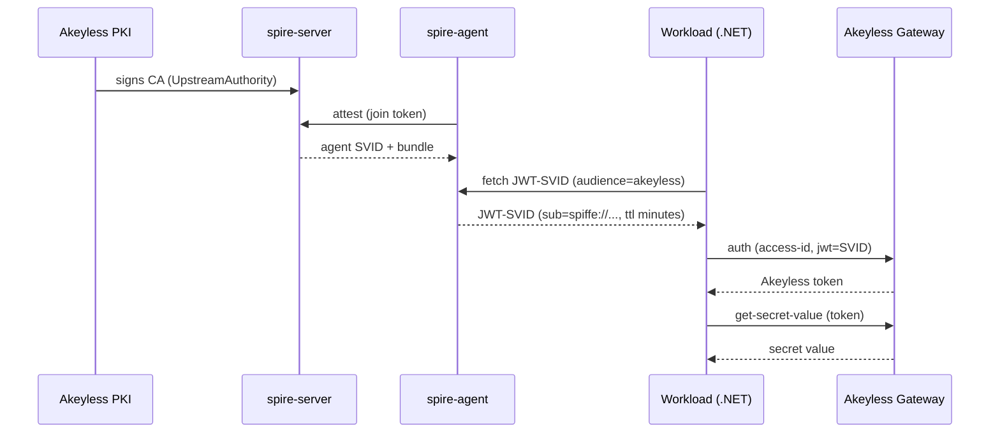
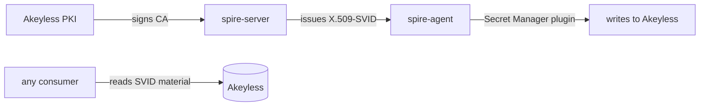

# Runtime Authentication to Akeyless with SPIFFE / SPIRE

A runnable reference for workload identity with SPIFFE and Akeyless. Demonstrates
two SVID paths: a JWT-SVID workload that reads a secret from Akeyless, and an
X.509-SVID workload whose identity material is stored in Akeyless automatically
via the Secret Manager plugin. The trust root is signed by Akeyless PKI. Akeyless
is a secrets manager, like HashiCorp Vault or AWS Secrets Manager.

New to SPIFFE or SPIRE? Read [Concepts](runbooks/01-concepts.md) first.

## Why use this

- The workload has no credential at rest. No token file, no API key on the workload host.
- Workloads prove who they are instead of carrying a credential.
- Identities are short-lived and audience-bound, so they expire on their own and cannot be replayed elsewhere.
- A workload's authority is scoped to a single secret path by a role bound to its identity.

| | Credential | Lifetime of a theft |
|---|---|---|
| Before | API key in `/etc/akeyless/key` | as long as the key is valid; no trace |
| After | a JWT-SVID fetched per call | minutes, then the SVID is dead and a replay is logged |

## How it works

Two workloads, two SVID types, one trust root signed by Akeyless.

**Workload 1: JWT-SVID (reads a secret)**



The workload fetches a JWT-SVID from the Workload API, trades it for an Akeyless
token, and reads the secret. The SVID lives only in memory for the call.

**Workload 2: X.509-SVID (stored in Akeyless)**



SPIRE issues the X.509-SVID and the Secret Manager plugin stores it in Akeyless
automatically. No application code. Any consumer can retrieve the identity
material.

See [Concepts](runbooks/01-concepts.md) for definitions.

## Alternatives


This repo is the SPIFFE/SPIRE counterpart to [akeyless-uid-runtime-auth](https://github.com/Fahmy-Kadiri-akl/akeyless-uid-runtime-auth), which solves the same problem with Akeyless Universal Identity.

| Concern | Universal Identity | SPIFFE / SPIRE |
|---|---|---|
| Credential on the host | A token file, rotated every few minutes | None. The SVID lives only in memory for the call. |
| Rotation mechanism | A systemd timer you install and operate | The SPIRE Workload API, at fetch time |
| Bootstrap material | One admin-generated token planted on the host | None. The workload is attested by SPIRE selectors. |
| Operational dependencies | Akeyless only | SPIRE server and agent, plus Akeyless |
| Best when | You want rotation without deploying SPIRE | You can run SPIRE and want zero on-disk credentials |

## Prerequisites

- Docker with the Compose v2 plugin. Verify with `docker compose version`.
- A short-lived Akeyless token starting with `t-`, with permission to create auth methods, roles, and secrets.
- Your Akeyless API gateway base URL (without `/api/v2`), reachable from the host running the app.

For token creation and the exact capabilities the token needs, see [Prerequisites](runbooks/02-prerequisites.md).

## Quick start

Run every command from the repository root. [Runbook 03](runbooks/03-quick-start.md) walks through the same steps with full explanations.

### 1. Clone

```bash
git clone https://github.com/Fahmy-Kadiri-akl/akeyless-spiffe-runtime-auth.git
cd akeyless-spiffe-runtime-auth
```

### 2. Configure

```bash
cp spire/spire.env.example .env
```

Edit `.env` and set four values:

| Value | What it is | Where it comes from |
|---|---|---|
| `AKEYLESS_GATEWAY` | your Akeyless gateway base URL (no `/api/v2`) | your Akeyless account |
| `AKEYLESS_TOKEN` | a short-lived admin token (`t-...`) for the one-time bootstrap | created from your normal auth method; expires on its own |
| `ACCESS_ID` | an access ID (`p-...`) that authenticates both SPIRE plugins to Akeyless | [create it first](runbooks/02-prerequisites.md#creating-the-plugin-credentials) |
| `ACCESS_KEY` | the matching key for `ACCESS_ID` (omit for cloud identity) | created alongside the access ID |

`.env` is gitignored, so none of these reach the repo.

Everything else in `.env` sits under the advanced section and already has defaults that work for the demo. Leave it as-is. What each value means, including what it would mean in production, is in the [Configuration reference](runbooks/05-configuration.md).

### 3. Start SPIRE

```bash
./spire/up.sh
```

The script ends with `==> SPIRE is up.`

### 4. Wire Akeyless

```bash
./bootstrap/setup-akeyless.sh
```

The script ends with `[setup] done.` It also creates the demo secret in Akeyless
at `/spiffe/demo/db-password` with a generated value. Change the path with
`AKEYLESS_SECRET` in `.env`. To use your own secret, create it in Akeyless
directly at that path first; the bootstrap leaves an existing secret alone.

### 5. Read the secret

```bash
docker compose --project-directory . -f spire/docker-compose.yml exec host \
  dotnet /app/bin/Release/net8.0/secret-consumer.dll
```

This runs the reference app. It fetches an SVID, trades it for an Akeyless token,
and reads the secret back from Akeyless. It prints:

```
[1/3] Fetching JWT-SVID (audience=akeyless) from /tmp/spire-agent/public/api.sock ...
      got SVID (330 bytes), sub=spiffe://example.org/ns/default/sa/secret-consumer, exp=...
[2/3] Authenticating to Akeyless at https://your-account.akeyless.cloud/api/v2/auth ...
      got Akeyless token (35 bytes)
[3/3] Reading secret /spiffe/demo/db-password ...
      secret value: spiffe-demo-<timestamp>
```

The `/spiffe/demo/db-password` path is the demo default; override it with
`AKEYLESS_SECRET` in `.env`. The value is a generated placeholder, not a real
secret; to use your own, provision it in Akeyless directly.

Re-run the command any time. Each run fetches a fresh SVID.

### Tear down

```bash
./spire/down.sh
```

If a step fails, find the matching error in [Troubleshooting](runbooks/08-troubleshooting.md).

## Where to go next

| Goal | Guide |
|---|---|
| Understand SPIFFE, SPIRE, SVIDs, trust domains, and audience | [Concepts](runbooks/01-concepts.md) |
| Verify your environment and permissions | [Prerequisites](runbooks/02-prerequisites.md) |
| The quick start with full explanations | [Quick start runbook](runbooks/03-quick-start.md) |
| How the one-time Akeyless wiring works | [Wiring Akeyless](runbooks/04-wiring-akeyless.md) |
| Understand every value in `.env`, including TTLs and production implications | [Configuration reference](runbooks/05-configuration.md) |
| Move from the demo to production, including per-environment trust domains | [Production hardening](runbooks/06-production.md) |
| Run an agent for your own app, host, or language | [Deploying agents](runbooks/07-deploying-agents.md) |
| Diagnose a failure | [Troubleshooting](runbooks/08-troubleshooting.md) |
| See X.509-SVIDs stored in Akeyless via Secret Manager | [X.509-SVID guide](runbooks/09-x509-svid-store.md) |
| Monitor a production deployment | [Operations](runbooks/10-operations.md) |
| Move from an API key to SPIFFE identity | [Migration playbook](runbooks/11-migration.md) |

## Security model

No credential is written to disk. The SVID lives only in memory for the call, is short-lived and audience-bound, and replaying it after expiry fails and is recorded in the Akeyless audit log. The workload's authority comes from the Akeyless role bound to its SPIFFE ID, not from the SVID itself.

A compromised host is not stopped in real time: an attacker running code as the workload's UID can fetch valid SVIDs for as long as they hold that position. The defense is detection and revocation, which the short SVID lifetime and audit log make possible. For the full model and its limits, see [Production hardening](runbooks/06-production.md).

## Repository layout

```
spire/                             SPIRE topology and orchestration
│
├── docker-compose.yml             spire-server and host services
├── Dockerfile.server              spire-server + Akeyless UpstreamAuthority plugin
├── Dockerfile.host                spire-agent + Secret Manager plugin + .NET app
├── server.conf                    trust domain, UpstreamAuthority, SVID lifetimes
├── agent.conf                     Workload API socket, SVIDStore plugin, bootstrap
├── host-entrypoint.sh             starts the agent, waits for the Workload API
├── up.sh                          start the stack, create PKI issuer, register workloads
├── down.sh                        tear down the stack
├── register-workload.sh           register the JWT-SVID workload by Unix UID
└── spire.env.example              template for .env

bootstrap/                         one-time Akeyless wiring (curl, no CLI)
│
├── setup-akeyless.sh              create auth method, role, demo secret
├── spiffe-bundle-to-jwks.py       convert the SPIRE bundle into a JWKS
└── verify-svid.sh                 decode and validate a JWT-SVID

agent/                             portable, app-agnostic SPIRE agent image
│
├── Dockerfile.agent               slim agent image, no application
├── agent.conf                     agent config template (env-rendered)
├── agent-entrypoint.sh            renders agent config from env, runs the agent
└── deploy-agent.sh                deploy the agent on a workload host

app/                               .NET 8 reference workload (JWT-SVID path)
│
├── Program.cs                     fetch SVID, authenticate, read secret
└── SecretConsumer.csproj

runbooks/                          guides 01-11: concepts through migration
│
├── README.md                      reading order and index
├── 01-concepts.md                 SPIFFE, SPIRE, SVIDs, trust domains
├── 02-prerequisites.md            environment, permissions, plugin credentials
├── 03-quick-start.md              get a secret end to end on one host
├── 04-wiring-akeyless.md          what the bootstrap does and why
├── 05-configuration.md            every .env value with production meaning
├── 06-production.md               trust root, selectors, environments
├── 07-deploying-agents.md         agent on each workload host
├── 08-troubleshooting.md          failure modes with causes and fixes
├── 09-x509-svid-store.md          X.509-SVID via Akeyless Secret Manager
├── 10-operations.md               monitoring, alerting, health checks
└── 11-migration.md                move from on-disk API key to SPIFFE

.github/workflows/
└── publish-image.yml              build and publish host + agent images to GHCR
```

## License

MIT.
