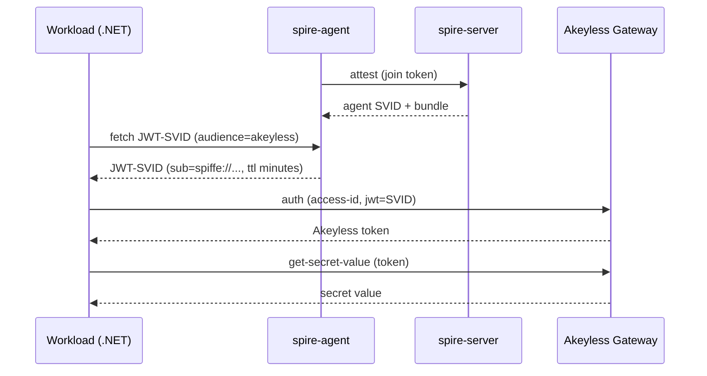

# Concepts you need first

Read this once before the quick start if SPIFFE, SPIRE, SVIDs, trust domains, or
audience are new to you. Every later runbook assumes these terms. Each idea
below says what it is, why it exists, and, where it matters, what it would mean
in production.

## The problem this solves

An unattended server needs to read a secret from Akeyless. A human is not
there to log in. The old answer is to plant a permanent credential on the host:
an API key, or a token file that some rotation job keeps fresh. That works, but
the credential sits on disk for the lifetime of the host. Anyone who can read
that file can act as the workload, and a copied credential keeps working long
after the theft, often with no signal that it happened.

The better answer is to stop storing a credential at all. Instead, the workload
proves who it is on each call, gets a short-lived token good for minutes, uses
it, and lets it expire. There is nothing to steal off the disk, because nothing
secret is ever written there. This repo is a working example of that approach
using SPIFFE and SPIRE for the identity, and Akeyless for the secret.

## The cast

Four participants appear throughout. It helps to hold them in mind before the
detail.

- **The workload** is your application. In this repo it is the .NET app in
  `app/`. It needs to read a secret and it holds no credential.
- **spire-server** is the authority that issues identities. There is normally
  one for the whole system.
- **spire-agent** runs on the same host as the workload. The workload talks
  only to its local agent, never to the server.
- **Akeyless** holds the secret and decides whether to hand it over.

## SPIFFE and the SPIFFE ID

SPIFFE is a standard for giving a workload a cryptographic identity. A workload
identity is written as a SPIFFE ID, which is a URI shaped like this:

```
spiffe://example.org/ns/default/sa/secret-consumer
```

It has two parts. The host part, `example.org`, is the trust domain. The path
part, `/ns/default/sa/secret-consumer`, names the specific workload inside that
domain. The workload uses this ID to say who it is, and Akeyless uses it to
decide what that identity is allowed to do.

## The trust domain, and why `example.org` is just a label

The trust domain is the boundary of trust. It is the host part of every SPIFFE
ID in the system. The server, the agent, every workload registration, and the
Akeyless role binding all share one trust domain. An identity issued inside a
trust domain is meaningful only inside that domain.

In this repo the trust domain is `example.org`. That value is a made-up label
for the demo. It is not a real internet domain and you do not need to own it.
The demo is self-contained, so a fake name is fine.

**What this means in production.** The trust domain is a name you choose and
control. Treat it as fixed for the lifetime of an environment, because every
SPIFFE ID is built from it. Two rules follow.

First, use a distinct trust domain per environment that must not trust each
other. Keep production and development in separate trust domains, so an
identity issued in development can never be accepted in production. If you run
SPIRE for separate tenants or teams that must not accept each other's
identities, give each its own trust domain.

Second, do not reuse the demo name `example.org` in production. It is the
public SPIFFE sample name, and reusing it signals a demo and risks collision if
another system ever trusts the same name. Pick something that identifies your
environment, such as `spiffe.acme.internal`.

Changing the trust domain of a running deployment rewrites every SPIFFE ID and
invalidates every registration and role binding. Set it once when you stand the
environment up.

## SPIRE: the server and the agent

SPIRE is the reference implementation of SPIFFE. It has two roles.

The **spire-server** is the central authority for the trust domain. It signs
identities and it records which workloads are allowed which SPIFFE IDs. You run
one server, or a small high-availability cluster, for the whole trust domain.

The **spire-agent** runs on every host that runs a workload. It does two jobs.
It proves the host itself to the server, which is called node attestation. And
it vouches for the individual workloads on that host, which is called workload
attestation. Your application never talks to the server directly. It talks only
to its local agent over a socket on the same host.

## Attestation: how a workload proves what it is

Attestation is how SPIRE decides a given process is allowed to receive a given
SPIFFE ID. There are two layers.

Node attestation happens once, when an agent first contacts the server. The
agent proves the host's identity, in this demo with a one-time join token the
server hands out. After that the agent keeps its own identity and reuses it.

Workload attestation happens every time a workload asks for an SVID. The agent
looks at the calling process and matches it against selectors. A selector is a
claim about a process, such as its Unix UID, its executable path, or a
container image label. In this demo the workload is registered with the
selector `unix:uid:0`, meaning any process running as UID 0 on the host can
receive the workload's SPIFFE ID.

**What this means in production.** The selector is the real gate on who can be
this workload. `unix:uid:0` is broad, because root is common and anything
running as root on the host qualifies. In production narrow it. Run the
workload under a dedicated UID and select on that, or select on the executable
path, or use the Docker workload attestor with an image or label selector. The
goal is that only the intended process can obtain the identity.

## SVIDs: the identity document

An SVID, short for SPIFFE Verifiable Identity Document, is the proof a workload
presents of its SPIFFE ID. SPIRE supports two forms.

### JWT-SVID, which this demo uses

A JWT-SVID is a signed JSON Web Token. The workload presents it to Akeyless,
and Akeyless checks the signature against a public key and checks the claims.
This repo uses JWT-SVID because Akeyless validates a JWT against a public key
set. The token is short-lived, measured in minutes, and it is minted fresh on
every run.

### X.509-SVID, which this demo does not use

An X.509-SVID is a certificate plus a private key. It is used for mutual TLS
between services, where two workloads establish an encrypted, authenticated
connection directly with each other.

This demo does not use, fetch, or test X.509-SVIDs. The .NET app fetches only a
JWT-SVID, and the Akeyless side is wired for JWT validation. If you need mTLS
between your own services, that is a separate SPIRE capability this repo does
not cover. Because nothing here requests an X.509-SVID, the `X509_SVID_TTL`
setting in `.env` has no effect on the demo. It exists only because SPIRE's
server configuration exposes it. See [Configuration](04-configuration.md) for
the detail.

## Audience: who the SVID is for

Every JWT-SVID carries an audience claim, which says who the token is intended
for. In this demo the audience is `akeyless`. When the workload asks the agent
for an SVID, it asks for one scoped to the `akeyless` audience, and Akeyless is
configured to require that audience.

The audience is a replay defense. A token minted for Akeyless carries the
`akeyless` audience, so it cannot be replayed against a different system that
expects a different audience. A token presented to the wrong audience is
rejected.

**What this means in production.** Keep audiences specific. If a workload talks
to several downstreams, give each its own audience and request the matching one
for each call, so a token stolen from one path cannot be used on another. Do
not broaden the audience to a shared value for convenience, because that
weakens the isolation the audience exists to provide.

## The Workload API and its socket

The spire-agent serves the Workload API on a local Unix socket. This is the
only way a workload obtains its SVIDs. The conventional socket path is:

```
/tmp/spire-agent/public/api.sock
```

SPIFFE client libraries and the `spire-agent` CLI look for this path by
default. The workload connects to this socket at call time, asks for a JWT-SVID
for a given audience, and receives it. The socket is local to the host, which
is one reason an agent must run on every host that runs a workload.

## Trust bundle and JWKS

For Akeyless to trust a JWT-SVID, it needs the public key that signed it.
SPIRE publishes its signing keys in a trust bundle. Akeyless validates a
JWT-SVID by checking its signature against the public key in the bundle.

The bundle is not a standard JWT key set on its own. SPIRE lists JWT signing
keys as base64 SubjectPublicKeyInfo blobs. The script
`bootstrap/spiffe-bundle-to-jwks.py` converts them into a standard JWKS, which
is a JSON document of public keys. The bootstrap stores that JWKS on the
Akeyless auth method so Akeyless can verify signatures at authentication time.

## The full picture

Now that every participant and concept is defined, the end-to-end flow is this.
Read it as a loop the workload runs on each call.



Step by step:

1. The agent attests to the server once, with a join token, and receives its
   own identity and the trust bundle. This is node attestation.
2. The workload asks its local agent for a JWT-SVID scoped to the `akeyless`
   audience, over the Workload API socket.
3. The agent checks the caller against its selectors in workload attestation,
   then issues a short-lived JWT-SVID carrying the workload's SPIFFE ID.
4. The workload sends that SVID to Akeyless's `/api/v2/auth` endpoint, along
   with the auth method's access id.
5. Akeyless verifies the SVID signature against the JWKS on the auth method,
   checks the audience, and matches the SPIFFE ID to the role. It returns a
   short-lived Akeyless token.
6. The workload calls `/api/v2/get-secret-value` with that token and reads the
   secret.

The SVID is fetched, used, and discarded on each call. It is never written to
disk.

## Why no on-disk credential matters

A static API key or a token file is a permanent or semi-permanent secret
sitting on disk. A copied key works for as long as the key lives, and the
theft is often invisible. A JWT-SVID fetched per call has no secret at rest.
There is nothing on disk for an attacker to copy and reuse later. The worst
case is a stolen token that expires in minutes, and a replay after expiry is
rejected and recorded in the Akeyless audit log.

Now read [Prerequisites](02-prerequisites.md).
