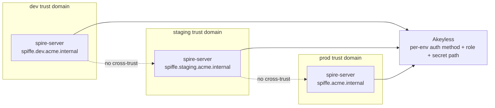
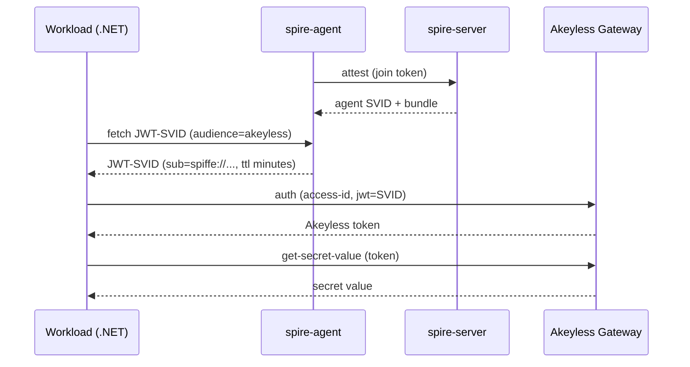

# Concepts you need first

The vocabulary this repo depends on: SPIFFE, SPIRE, SVIDs, trust domains,
attestation, audience. Later runbooks assume it. Read this once before the
quick start if any of it is new.

## The problem

An unattended server needs to read a secret from Akeyless. No human is there to
log in. The conventional fix is a permanent credential on the host: an API key,
or a token file a rotation job keeps fresh. The credential then sits on disk for
the life of the host. Anyone who can read that file becomes the workload, and a
copied credential keeps working long after the theft, usually with no signal.

This repo takes the other path. The workload proves who it is on each call,
receives a token good for minutes, uses it, and lets it expire. Nothing secret
is written to disk, so there is nothing to steal. SPIFFE and SPIRE provide the
identity; Akeyless holds the secret.

## The cast

| Participant | Role | In this repo |
|---|---|---|
| Workload | Your application. Holds no credential. | the .NET app in `app/` |
| spire-server | Authority that issues identities. One per trust domain. | runs in Docker |
| spire-agent | Vouches for workloads on a host. The workload talks only to its local agent. | co-located with the app |
| Akeyless | Holds the secret and decides whether to hand it over. | your account |

## SPIFFE ID

SPIFFE is a standard for giving a workload a cryptographic identity. That
identity is a URI called a SPIFFE ID:

```
spiffe://example.org/ns/default/sa/secret-consumer
        └─────┬─────┘ └────────┬────────┘
       trust domain      workload path
```

The host part is the **trust domain**, the boundary of trust. The path is
free-form; the spec mandates only the scheme and the trust domain. This repo
follows the Kubernetes convention `/ns/<namespace>/sa/<name>`, where `/sa/` is
short for service account. You may use any path, such as `/service/billing`.
The path identifies the workload, and because Akeyless matches the full SPIFFE
ID, two workloads in the same domain get different access by using different
paths. The workload presents this ID; Akeyless maps it to a role.

## The trust domain

The trust domain is the boundary of trust. The server, every agent, every
workload registration, and the Akeyless role binding all share one trust domain.
An identity issued inside it is meaningful only inside it.

The demo uses `example.org`. That is a made-up label, not a real internet
domain, and you do not need to own it. It is fine for a self-contained demo.

> [!WARNING]
> `example.org` is the public SPIFFE sample name. Use it only for the demo. In
> production choose a name you control, such as `spiffe.acme.internal`, and
> never reuse a trust domain across environments. Reusing it signals "demo" and
> risks collision if another system ever trusts the same name.

Pick one trust domain per trust boundary, and treat it as fixed. Every SPIFFE
ID is built from it, so changing it later rewrites every ID and invalidates
every registration and role binding.

### Separate environments with separate trust domains

The cleanest isolation is one trust domain per environment that must not trust
another. An SVID minted in dev then cannot authenticate in production, because
the domain, the JWKS Akeyless holds, and the role binding all differ.

| Environment | Trust domain | Why separate |
|---|---|---|
| dev | `spiffe.dev.acme.internal` | throwaway; must never be trusted by prod |
| qa | `spiffe.qa.acme.internal` | isolated test tier |
| staging | `spiffe.staging.acme.internal` | mirrors prod, still walled off |
| prod | `spiffe.acme.internal` | the real boundary |



If your organization also separates by business unit, encode the unit in the
trust domain. Each environment-and-unit pair is its own trust domain:

```
spiffe://prod.payments.acme.internal/sa/billing
        └─────────────┬────────────┘ └────┬────┘
                 trust domain           workload
             (environment + unit)

spiffe://prod.search.acme.internal/sa/indexer
```

`payments` is part of the trust domain, so it sets who is trusted. `billing` is
the workload path, so it sets which service this is and what it may do. One unit
runs many workloads, each with its own path, so each can hold a different
secret. The [production guide](05-production.md#business-unit-model) works
through a multi-workload example.

Two units that must not accept each other's identities get separate domains.
The rare case where environments or units genuinely need to honor each other's
identities uses SPIFFE federation, never a shared trust domain.

## SPIRE: server and agent

SPIRE is the reference implementation of SPIFFE.

- **spire-server** signs identities and records which workloads may hold which
  SPIFFE IDs. Run one, or a small HA cluster, per trust domain.
- **spire-agent** runs on every host that runs a workload. It proves the host to
  the server, then vouches for individual workloads on that host. Your app talks
  only to its local agent over a socket.

## Attestation

Attestation is how SPIRE decides a process may receive a SPIFFE ID. There are
two layers, and each has a demo form and a production form.

| Layer | When it runs | Demo | Production |
|---|---|---|---|
| Node attestation | Once, when an agent first contacts the server | one-time join token | cloud IID, Kubernetes service account token, or mTLS with a pre-shared bundle |
| Workload attestation | Every SVID fetch | selector `unix:uid:0` | a dedicated UID, the executable path, or a Docker image or label selector |

The workload-attestation selector is the real gate on who can be this workload.
The demo uses `unix:uid:0`, which is broad: any root process on the host
qualifies. Narrow it in production so only the intended process can obtain the
identity.

## SVIDs

An SVID, a SPIFFE Verifiable Identity Document, is the proof a workload presents
of its SPIFFE ID. SPIRE supports two forms.

| SVID | Form | Used for | In this repo |
|---|---|---|---|
| JWT-SVID | Signed JSON Web Token | Bearer authentication to a service such as Akeyless | Yes. The .NET app trades one for an Akeyless token. |
| X.509-SVID | Certificate plus private key | Mutual TLS between two workloads | Yes, in the optional [mTLS demo](08-x509-mtls.md). |

A JWT-SVID is short-lived, measured in minutes, and minted fresh on every run.
Akeyless validates it against a public key set, which is why the secret-reading
path uses JWT-SVIDs. X.509-SVIDs serve a different problem, workload-to-workload
mTLS, shown separately in guide 08.

## Audience

Every JWT-SVID carries an audience claim naming who the token is for. The demo
audience is `akeyless`. The workload asks for an SVID scoped to that audience,
and Akeyless requires it.

Audience is a replay defense. A token minted for Akeyless cannot be replayed
against a system that expects a different audience. Keep audiences specific in
production: if a workload talks to several downstreams, give each its own
audience and request the matching one per call, so a token stolen from one path
cannot be used on another.

## The Workload API socket

The agent serves the Workload API on a local Unix socket. It is the only way a
workload obtains SVIDs:

```
/tmp/spire-agent/public/api.sock
```

SPIFFE libraries and the `spire-agent` CLI look there by default. The socket is
local to the host, which is one reason an agent must run on every host that runs
a workload.

## Trust bundle and JWKS

For Akeyless to trust a JWT-SVID it needs the public key that signed it. SPIRE
publishes signing keys in a trust bundle. SPIRE lists JWT keys as base64
SubjectPublicKeyInfo blobs; `bootstrap/spiffe-bundle-to-jwks.py` converts them
into a standard JWKS, and the bootstrap stores that JWKS on the Akeyless auth
method. Akeyless then verifies SVID signatures at authentication time.

## The full picture

With every piece defined, the end-to-end flow is a loop the workload runs each
call.



1. The agent attests to the server once with a join token and receives its own
   identity and the trust bundle.
2. The workload asks its local agent for a JWT-SVID scoped to the `akeyless`
   audience.
3. The agent matches the caller against its selectors, then issues a short-lived
   JWT-SVID carrying the workload's SPIFFE ID.
4. The workload sends the SVID to `/api/v2/auth` with the auth method's access
   id.
5. Akeyless verifies the signature against the JWKS, checks the audience, and
   matches the SPIFFE ID to the role. It returns a short-lived token.
6. The workload calls `/api/v2/get-secret-value` with that token and reads the
   secret.

The SVID is fetched, used, and discarded on each call. It is never written to
disk.

## Why no on-disk credential matters

A static API key or token file is a permanent secret on disk. A copy works for
as long as the key lives, and the theft is often invisible. A per-call JWT-SVID
leaves no secret at rest: nothing for an attacker to copy and reuse. The worst
case is a stolen token that expires in minutes, and a replay after expiry is
rejected and recorded in the Akeyless audit log.

Next: [Prerequisites](02-prerequisites.md)
