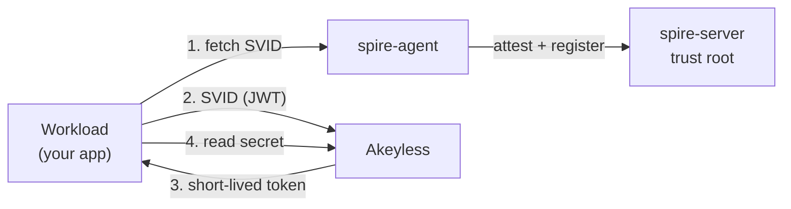

# Concepts you need first

If you have never worked with SPIFFE, SPIRE, or Akeyless machine identity,
read this once. Everything else in the runbooks assumes these terms.

## The problem in one sentence

An unattended server needs to prove who it is to Akeyless to fetch a secret,
without a human logging in and without a permanent key sitting on disk.



## SPIFFE and SPIFFE IDs

SPIFFE is a standard for giving workloads a cryptographic identity. A workload
identity is written as a SPIFFE ID, which is a URI that looks like:

```
spiffe://example.org/ns/default/sa/secret-consumer
```

It has two parts: a trust domain (`example.org`) and a path
(`/ns/default/sa/secret-consumer`). The trust domain is the boundary of who
issues and trusts these identities. Everything in this repo uses the trust
domain `example.org` by default.

## SPIRE: server and agent

SPIRE is the reference implementation of SPIFFE. It has two roles:

- The **spire-server** is the central authority for the trust domain. It signs
  identities and tracks which workloads are allowed which SPIFFE IDs. You run
  one, or a small cluster, for the whole trust domain.
- The **spire-agent** runs on every host that runs a workload. It proves the
  host's identity to the server (node attestation), then vouches for individual
  workloads on that host (workload attestation). Your application never talks
  to the server directly; it talks to its local agent.

## SVIDs: the identity document

An SVID (SPIFFE Verifiable Identity Document) is the proof of a workload's
SPIFFE ID. There are two forms:

- **JWT-SVID**: a signed JSON Web Token. This is what this repo uses, because
  Akeyless can validate a JWT against a public key set (JWKS).
- **X.509-SVID**: a certificate and private key, used for mTLS. Not used here.

A JWT-SVID is short-lived (minutes) and audience-bound. It is minted fresh each
time and expires on its own, so a stolen one stops working quickly.

## The Workload API and its socket

The spire-agent exposes the **Workload API** on a local Unix socket so
workloads can ask for their SVIDs. The conventional socket path is:

```
/tmp/spire-agent/public/api.sock
```

SPIFFE client libraries and the `spire-agent` CLI look for this path by
default. The workload fetches a JWT-SVID from this socket at call time.

## Trust bundles and JWKS

A trust bundle is the set of public keys a trust domain uses to sign
identities. Akeyless validates a JWT-SVID by checking its signature against the
public key in the bundle. The bundle is published as a **JWKS** (JSON Web Key
Set), which is just a JSON document of public keys.

## How a workload gets a secret, end to end

1. The agent attests the workload and the server issues it a JWT-SVID.
2. The workload sends the JWT-SVID to Akeyless.
3. Akeyless checks the signature against the bundle JWKS and the SPIFFE ID
   against an access role.
4. Akeyless returns a short-lived token, which the workload uses to read the
   secret.

Nothing secret is written to disk. The SVID is fetched, used, and discarded on
each call.

## Why no on-disk credential matters

Static API keys and token files are permanent or semi-permanent secrets sitting
on disk. A copied key works forever and fails silently. A JWT-SVID fetched per
call has no secret at rest: nothing for an attacker to copy off the host and
reuse later.

Now read [02-prerequisites.md](02-prerequisites.md).
