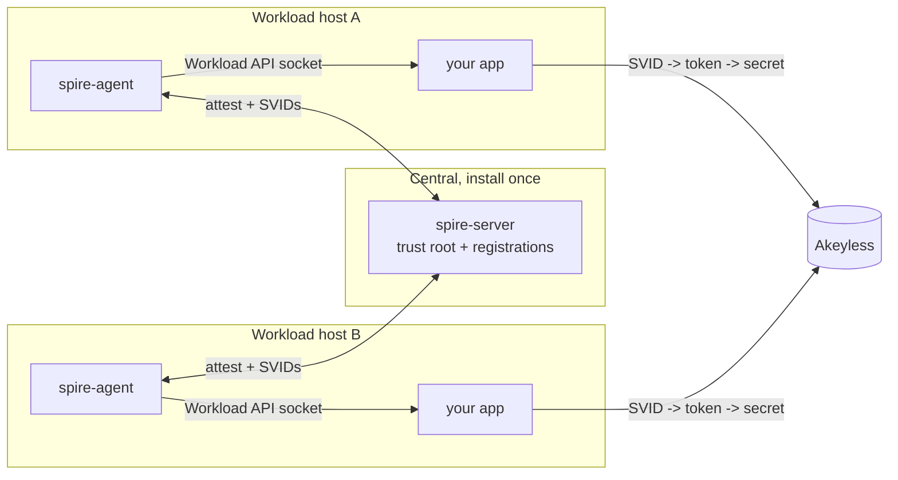

# Deploying an agent for your application

The quick start runs everything on one host. In production your application
runs on many hosts. The model is: one central `spire-server`, and one
`spire-agent` on every host that runs a workload. The agent is the only SPIRE
component that must be on each host, because workload attestation reads local
process attributes and the Workload API is a local Unix socket.



The server is the only piece installed once; every host runs an agent and its
own application, which fetches SVIDs from its local agent and uses them against
Akeyless independently.

## The portable agent image

The repo publishes a pre-built, app-agnostic agent image to GHCR at
`ghcr.io/fahmy-kadiri-akl/akeyless-spiffe-runtime-auth/agent`. It runs only the
SPIRE agent and serves the Workload API, so any application in any language can
use it for identity. Because it carries no application code, it stays fully
decoupled from whatever you run.

## Deploy on a workload host

1. On the server, generate a one-time join token for this host's agent:

   ```bash
   spire-server token generate -spiffeID spiffe://<trust-domain>/agent/<host-name>
   ```

2. On the workload host, deploy the agent with the deploy script:

   ```bash
   SPIRE_SERVER_ADDRESS=<server-host-or-ip> JOIN_TOKEN=<token> \
     SPIFFE_TRUST_DOMAIN=<trust-domain> ./agent/deploy-agent.sh
   ```

   To reach a server whose port is published on the same Docker host, set
   `SPIRE_SERVER_ADDRESS=host.docker.internal`.

   The script runs the agent with the host PID namespace (so the unix workload
   attestor can see host-side workloads of any language) and waits until the
   Workload API socket is up at `/tmp/spire-agent/public/api.sock`.

3. On the server, register the workload against that agent with a selector
   that matches the workload's identity (Unix UID, process path, or a container
   label via the docker workload attestor).

4. Point your application at the socket, `/tmp/spire-agent/public/api.sock`,
   and fetch a JWT-SVID from the Workload API with the `spire-agent` CLI or a
   SPIFFE SDK in your language. The app then uses the SVID to authenticate to
   Akeyless exactly as the reference app does.

## One server, many hosts

The `spire-server` is the only piece you install once, centrally. Every agent
and every admin operation talks to it. The agent is installed on each workload
host, as a systemd service, a container, or in Kubernetes via the SPIRE CSI
driver or a per-node agent DaemonSet. Each workload is registered against the
central server with its own selectors.

## Notes

- Workload attestation is local. An application on host B cannot fetch an SVID
  from an agent on host A. Run an agent on every host that runs a workload.
- The dev agent config sets `insecure_bootstrap = true` because the demo
  self-signs its trust root. In production, distribute the server bundle and
  remove that flag.
