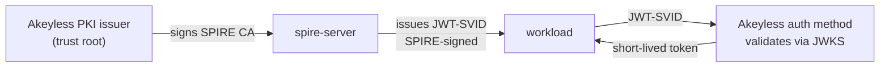

# Production hardening

The quick start is a self-contained demo. This guide covers the changes that
make it safe to run in production. Each section says what the demo does, what
production needs instead, and why.

## Trust root: make Akeyless the upstream authority

The demo self-signs the SPIRE CA. The server creates its own root certificate
on first run and stores it in a Docker volume. That is fine for an isolated
demo, because the trust domain never leaves your machine. It is not fine for
production, because a self-signed root in a local volume is hard to rotate,
hard to audit, and trusted by no one but itself.

In production, make Akeyless the upstream authority so it signs and rotates
SPIRE's CA. Set up the SPIRE Upstream Authority plugin against an Akeyless PKI
certificate issuer. SPIRE then uses the Akeyless-issued CA as its trust root.

Akeyless signs the trust-root CA, but JWT-SVIDs stay signed by SPIRE's own key.
The JWT-to-Akeyless flow works the same whether the CA is self-signed or
Akeyless-issued. This setup was validated end to end, and the details below are
the ones that are easy to get wrong.

- The plugin's `akeyless_gateway_url` must include the API path, for example
  `https://your-gateway/api/v2`. The auth endpoint is `/api/v2/auth`. Without
  the path the call hits the wrong endpoint and fails.
- If your gateway uses a self-signed or internal CA, set the plugin's
  `custom_ca_bundle` to a file holding that CA certificate. The plugin verifies
  TLS strictly and will not trust an unconfigured internal CA.
- The PKI certificate issuer's `allowed-uri-sans` must include the trust-domain
  root itself, for example `spiffe://example.org`, not only
  `spiffe://example.org/*`. SPIRE's CA carries the root URI SAN, and the
  wildcard alone does not match it.

## Bundle distribution: let Akeyless track rotation

The demo inlines the JWKS into the auth method at bootstrap time. That works
for a fixed dev trust domain, but it goes stale whenever SPIRE rotates its JWT
signing key on the CA cadence. When the JWKS is stale, Akeyless rejects every
SVID until you re-run `bootstrap/setup-akeyless.sh`.

In production, set `SPIRE_BUNDLE_ENDPOINT` to a public bundle endpoint. Akeyless
then fetches the bundle at runtime and tracks key rotation automatically, so
authentication keeps working across rotations with no manual re-bootstrap.

## Workload selectors: narrow who can be the workload

The demo registers the workload with the selector `unix:uid:0`. Any process
running as UID 0 on the host can fetch the workload's SVID. That is acceptable
for a local demo where you control the whole host. It is too broad for
production, because root is common and any root process qualifies.

In production, narrow the selector so only the intended process can obtain the
identity. Run the workload under a dedicated UID and select on that UID, or
select on the executable path, or use the Docker workload attestor with an
image or label selector. The selector is the real gate on who can be this
workload, so treat it as a security boundary.

## Agent bootstrap: drop the insecure flag

The demo agent sets `insecure_bootstrap = true`. The agent bootstraps its trust
in the server without a pre-shared bundle, because the server's self-signed CA
only exists after first run and there is no secure channel to carry it ahead of
time. That is acceptable inside an isolated dev trust domain.

Never set `insecure_bootstrap = true` against a production trust domain. An
attacker who intercepts the first connection could substitute their own server.
In production, distribute the server bundle to the agent out of band and remove
the flag, so the agent authenticates the server from the start.

## Security model and limitations

These properties hold in production as well as in the demo.

- No credential is written to disk. The SVID exists only in memory for the
  call.
- The SVID is short-lived and audience-bound. A captured SVID is useless after
  it expires, and replaying it after expiry fails and is recorded in the
  Akeyless audit log.
- The workload's authority comes from the Akeyless role bound to its SPIFFE ID,
  not from the SVID itself.

These limits also hold, and you should plan around them.

- Compromise of the SPIRE server, or of its registration policy, compromises
  every workload it attests. Protect the server accordingly.
- A compromised host is not stopped in real time. An attacker running code as
  the workload's UID can fetch valid SVIDs and secrets for as long as they hold
  that position. The defense is detection and revocation, which the short SVID
  lifetime and the audit log make possible.
