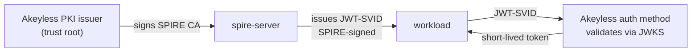
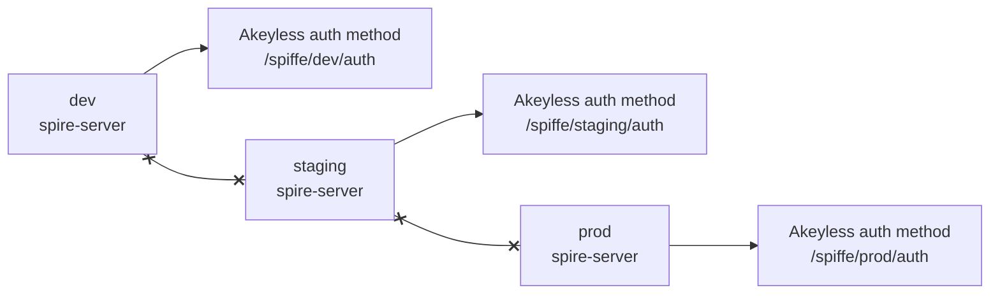

# Production hardening

The quick start is a self-contained demo. This guide is the delta to run it for
real. Each concern has a demo form and a production form.

## Demo versus production at a glance

| Concern | Demo | Production |
|---|---|---|
| Trust root | self-signed CA in a Docker volume | Akeyless PKI as the SPIRE upstream authority |
| Bundle to Akeyless | inline JWKS; re-run the bootstrap on rotation | `SPIRE_BUNDLE_ENDPOINT` public endpoint; Akeyless tracks rotation |
| Workload selector | `unix:uid:0`, any root process | dedicated UID, executable path, or container image or label selector |
| Agent bootstrap | `insecure_bootstrap = true` | server bundle distributed out of band; flag removed |
| Server | one container on one host | HA cluster, one per trust domain |
| Trust domain | `example.org` | a name you control, unique per environment |

## Trust root: Akeyless as upstream authority

A self-signed root in a local volume is hard to rotate, hard to audit, and
trusted by no one but itself. Make Akeyless the upstream authority so it signs
and rotates SPIRE's CA. Configure the SPIRE Upstream Authority plugin against
an Akeyless PKI certificate issuer.



Akeyless signs the trust-root CA, but JWT-SVIDs stay signed by SPIRE's own key,
so the Akeyless flow is unchanged. This setup was validated end to end. The
details that are easy to get wrong:

- The plugin's `akeyless_gateway_url` must include the API path, for example
  `https://your-gateway/api/v2`. The auth endpoint is `/api/v2/auth`; without
  the path the call hits the wrong endpoint and fails.
- For a self-signed or internal gateway CA, set the plugin's `custom_ca_bundle`
  to that CA certificate file. The plugin verifies TLS strictly.
- The PKI issuer's `allowed-uri-sans` must include the trust-domain root itself,
  `spiffe://<trust-domain>`, not only the wildcard `spiffe://<trust-domain>/*`.
  SPIRE's CA carries the root URI SAN, and the wildcard alone does not match it.

## Bundle distribution

The demo inlines the JWKS at bootstrap time. It goes stale whenever SPIRE
rotates its JWT signing key on the CA cadence, and Akeyless rejects every SVID
until you re-run `bootstrap/setup-akeyless.sh`. In production set
`SPIRE_BUNDLE_ENDPOINT` to a public bundle endpoint. Akeyless fetches the bundle
at runtime and tracks rotation automatically, so authentication survives
key rotation with no manual re-bootstrap.

## Workload selectors

The selector is the real gate on who can be this workload, so treat it as a
security boundary. The demo's `unix:uid:0` lets any root process on the host
fetch the SVID. Narrow it: run the workload under a dedicated UID and select on
that UID, or select on the executable path, or use the Docker workload attestor
with an image or label selector.

## Agent bootstrap

> [!WARNING]
> Never set `insecure_bootstrap = true` against a production trust domain. The
> demo sets it because the server's self-signed CA only exists after first run
> and there is no secure channel yet. An attacker who intercepts that first
> connection could substitute their own server. In production, distribute the
> server bundle to the agent out of band and remove the flag, so the agent
> authenticates the server from the start.

## Environments and trust domains

One trust domain per trust boundary. Environments that must not trust each
other get separate trust domains, separate servers, and separate Akeyless wiring.

### Lifecycle model

| Environment | Trust domain | Server | Akeyless objects |
|---|---|---|---|
| dev | `spiffe.dev.acme.internal` | throwaway | `/spiffe/dev/...` |
| qa | `spiffe.qa.acme.internal` | shared qa | `/spiffe/qa/...` |
| staging | `spiffe.staging.acme.internal` | mirrors prod | `/spiffe/staging/...` |
| prod | `spiffe.acme.internal` | HA cluster | `/spiffe/prod/...` |



The dashed lines mean what does not happen: an SVID from dev is not valid
against the staging or prod auth method. Different domain, different JWKS,
different role binding.

### Business-unit model

If units must not accept each other's identities, encode the unit in the trust
domain. Each environment-and-unit pair is its own domain with its own server:

```
spiffe://prod.payments.acme.internal/sa/billing
spiffe://prod.search.acme.internal/sa/indexer
```

The rare case where two domains must genuinely honor each other's identities
uses SPIFFE federation, not a shared trust domain.

> [!WARNING]
> `example.org` is the public SPIFFE sample name. Use it only for the demo. In
> production choose a name you control, such as `spiffe.acme.internal`, and
> never reuse a trust domain across environments.

### How to stand up an environment

- Set `SPIFFE_TRUST_DOMAIN` to the environment's domain in `.env`. `spire/up.sh`
  renders it into the server and agent configs and every SPIFFE ID.
- Namespace the bootstrap objects with `AKEYLESS_AUTH_METHOD`,
  `AKEYLESS_ROLE`, and `AKEYLESS_SECRET` so each environment gets its own paths.
- Run one server per trust domain. Stand it up once; changing the domain later
  rewrites every SPIFFE ID and breaks every registration and role binding.

## Security model and limits

Properties that hold in production as in the demo:

- No credential is written to disk. The SVID exists only in memory for the call.
- The SVID is short-lived and audience-bound. A captured SVID is useless after
  expiry, and a replay after expiry fails and is recorded in the Akeyless audit
  log.
- The workload's authority comes from the Akeyless role bound to its SPIFFE ID,
  not from the SVID itself.

Limits to plan around:

- Compromise of the SPIRE server, or of its registration policy, compromises
  every workload it attests. Protect the server accordingly.
- A compromised host is not stopped in real time. An attacker running code as
  the workload's UID can fetch valid SVIDs and secrets for as long as they hold
  that position. The defense is detection and revocation, which the short SVID
  lifetime and the audit log make possible.

Next: [Deploying agents](06-deploying-agents.md)
