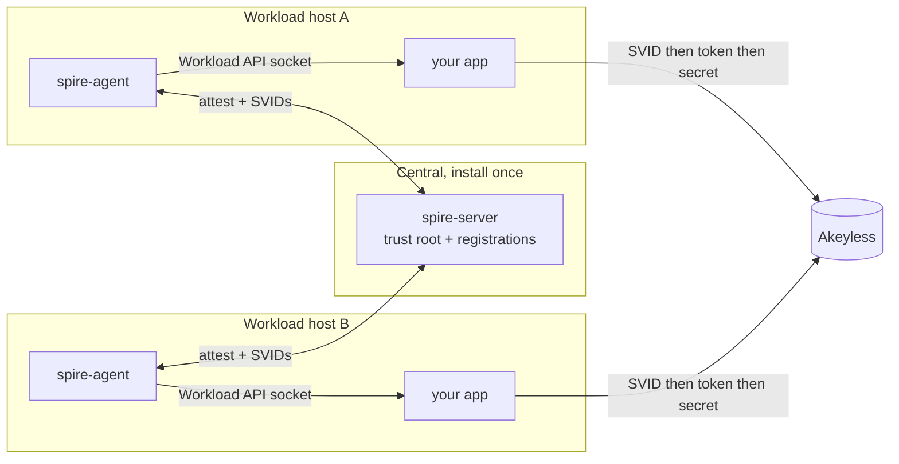

# Deploying an agent for your application

The quick start runs the server, the agent, and the app all on one host. In
production your applications run on many hosts. This guide explains the model
and how to put an agent on each host so your own application can get an
identity.

The server side, HA and one server per trust domain, is covered in
[Production hardening](05-production.md). This guide is about the agents on
your workload hosts.

## One server, one agent per host

The model is one central `spire-server` for the whole trust domain, and one
`spire-agent` on every host that runs a workload.



The server is the only piece you install once. Every agent and every admin
operation talks to it. The agent is installed on each workload host. Two facts
force the agent to be local, and these are the reason you cannot share one
agent across hosts.

- Workload attestation reads local process attributes, such as UID, PID, path,
  or container selectors. Only an agent on the same host can observe those.
- The Workload API is a Unix domain socket. The workload connects to an agent
  on the same host, not over the network.

A concrete fleet: one central server, three workload hosts, each running its own
app beside a local agent.

| Host | App | Registered as |
|---|---|---|
| host-a | billing | `spiffe://prod.payments.acme.internal/sa/billing` |
| host-b | payouts | `spiffe://prod.payments.acme.internal/sa/payouts` |
| host-c | recon | `spiffe://prod.payments.acme.internal/sa/recon` |

Each app authenticates to Akeyless on its own, through its own agent. Adding a
host means installing an agent on it and registering its workload on the server.

An application on host B therefore cannot fetch an SVID from an agent on host
A. Run an agent on every host that runs a workload.

## The portable agent image

The repo publishes a pre-built, app-agnostic agent image to GHCR at
`ghcr.io/fahmy-kadiri-akl/akeyless-spiffe-runtime-auth/agent`. It runs only the
SPIRE agent and serves the Workload API, so any application in any language can
use it for identity. Because it contains no application code, it stays fully
decoupled from whatever you run.

## Deploy on a workload host

You deploy the agent with `agent/deploy-agent.sh`, pointing at a central
spire-server. You do not need the bundled docker-compose server or the demo app
on that host.

1. On the server, generate a one-time join token for this host's agent:

   ```bash
   spire-server token generate -spiffeID spiffe://<trust-domain>/agent/<host-name>
   ```

   Avoid the path prefix `/spire/`, which SPIRE reserves for the server. This
   guide uses `/agent/<host-name>`.

2. On the workload host, deploy the agent:

   ```bash
   SPIRE_SERVER_ADDRESS=<server-host-or-ip> JOIN_TOKEN=<token> \
     SPIFFE_TRUST_DOMAIN=<trust-domain> ./agent/deploy-agent.sh
   ```

   To reach a server whose port is published on the same Docker host, set
   `SPIRE_SERVER_ADDRESS=host.docker.internal`.

   The script starts the agent with the host PID namespace, so the Unix
   workload attestor can see host-side workloads of any language, and it waits
   until the Workload API socket is up at `/tmp/spire-agent/public/api.sock`.

3. On the server, register the workload against that agent with a selector that
   matches the workload's identity. In production use a dedicated UID, a process
   path, or a container label via the Docker workload attestor. See
   [Workload selectors](05-production.md#workload-selectors).

4. Point your application at the socket,
   `/tmp/spire-agent/public/api.sock`, and fetch a JWT-SVID from the Workload
   API with the `spire-agent` CLI or a SPIFFE SDK in your language. The reference
   app reads this path from `SPIFFE_WORKLOAD_SOCKET`. The app then authenticates
   to Akeyless exactly as the reference app does.

## How the agent runs

The agent image is driven entirely by environment variables, so it needs no
config file on the host. `SPIRE_SERVER_ADDRESS`, `SPIFFE_TRUST_DOMAIN`, and
`JOIN_TOKEN` are required. `SPIRE_SERVER_PORT` defaults to 8081. The join token
attests the node to the server once. After that, the agent persists its own
SVID and reuses it across restarts.

`agent/Dockerfile.agent` and `agent/agent-entrypoint.sh` define the image. The
publish workflow rebuilds it on every change.

## Notes for production

- The deployed agent still sets `insecure_bootstrap = true`, which is the dev
  default. For a production trust domain, distribute the server bundle to the
  agent and remove that flag. See
  [Agent bootstrap](05-production.md#agent-bootstrap).
- Run the agent as a systemd service from the native binary, as a container, or
  in Kubernetes through the SPIRE CSI driver or a per-node agent DaemonSet.
  These are the standard production patterns.
- Each workload is registered against the central server with its own
  selectors. The server is the single source of truth for who is allowed to be
  what.

Now read [Troubleshooting](07-troubleshooting.md).
