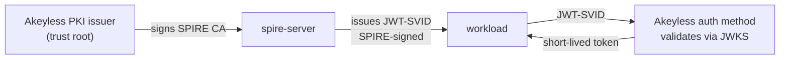
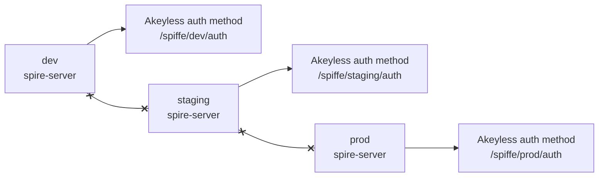
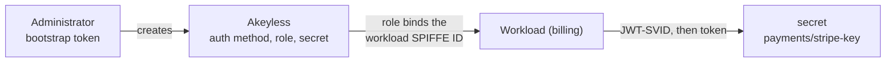

# Production hardening

Each concern has a demo form and a production form.

## Demo versus production at a glance

| Concern | Demo | Production |
|---|---|---|
| Trust root | Akeyless UpstreamAuthority | same. Use cloud identity (aws_iam/gcp/azure) instead of api_key in production |
| Bundle to Akeyless | inline JWKS; re-run the bootstrap on rotation | `SPIRE_BUNDLE_ENDPOINT` public endpoint; Akeyless tracks rotation |
| Workload selector | `unix:uid:0`, any root process | dedicated UID, executable path, or container image or label selector |
| Agent bootstrap | `insecure_bootstrap = true` | server bundle distributed out of band; flag removed |
| Server | one container on one host | HA cluster, one per trust domain |
| Trust domain | `example.org` | a name you control, unique per environment |

## Trust root: Akeyless UpstreamAuthority

The UpstreamAuthority plugin signs and rotates the trust root through Akeyless
PKI. The demo creates the PKI issuer and configures the plugin automatically via
`UPSTREAM_ACCESS_ID`, `UPSTREAM_ACCESS_KEY`, and `UPSTREAM_CERT_ISSUER` in
`.env`.



Akeyless signs the trust-root CA, but JWT-SVIDs stay signed by SPIRE's own key,
so the Akeyless flow is unchanged.

The plugin is a pre-built binary downloaded from `download.akeyless.io`. The
`spire/Dockerfile.server` image includes it. The `server.conf` stanza:

```hcl
UpstreamAuthority "akeyless_upstream" {
    plugin_cmd = "/opt/spire/AkeylessUpstreamAuthority"
    plugin_data {
        akeyless_gateway_url  = "https://your-gateway/api/v2"
        access_id             = "<p-...>"
        access_key            = "<key>"
        pki_cert_issuer_name  = "<issuer-name>"
    }
}
```

The `access_id` and `access_key` authenticate the plugin to Akeyless PKI.
For cloud identity (aws_iam, gcp, azure), omit `access_key` and set the
matching `access_type`. See the
[Akeyless SPIRE Upstream Authority guide](https://docs.akeyless.io/docs/spire-upstream-authority)
for the full field reference.

The details that are easy to get wrong:

- The plugin's `akeyless_gateway_url` must include the API path, for example
  `https://your-gateway/api/v2`.
- For an internal gateway CA, set the plugin's `custom_ca_bundle` to that CA
  certificate file.
- The PKI issuer's `allowed-uri-sans` must include the trust-domain root itself,
  `spiffe://<trust-domain>`, not only the wildcard `spiffe://<trust-domain>/*`.
- Ensure SPIRE TTL values are lower than the PKI issuer's TTL.

## Bundle distribution

Use this wherever SPIRE rotates keys, so authentication survives rotation
without a manual re-bootstrap. The demo inlines the JWKS at bootstrap time. It
goes stale whenever SPIRE rotates its JWT signing key on the CA cadence, and
Akeyless rejects every SVID until you re-run `bootstrap/setup-akeyless.sh`. In production set
`SPIRE_BUNDLE_ENDPOINT` to a public bundle endpoint. Akeyless fetches the bundle
at runtime and tracks rotation automatically, so authentication survives
key rotation with no manual re-bootstrap.

The rotation timeline, end to end:

1. SPIRE rotates its JWT signing key every `CA_TTL`, default 24 hours.
2. Inline JWKS: the auth method still holds the old key, so new SVIDs are
   rejected until you re-run `bootstrap/setup-akeyless.sh`.
3. Bundle endpoint: Akeyless fetches the new bundle on its own, and
   verification keeps working across the rotation with no re-bootstrap.

## Workload selectors

Narrowing the selector shrinks the blast radius of a compromised process to
its own identity. The selector is the real gate on who can be this workload, so
treat it as a security boundary. The demo's `unix:uid:0` lets any root process
on the host fetch the SVID. Narrow it: run the workload under a dedicated UID and select on
that UID, or select on the executable path, or use the Docker workload attestor
with an image or label selector.

## Agent bootstrap

> [!WARNING]
> Never set `insecure_bootstrap = true` against a production trust domain. The
> demo sets it because the agent has no pre-shared server bundle on first
> connection could substitute their own server. In production, distribute the
> server bundle to the agent out of band and remove the flag, so the agent
> authenticates the server from the start.

## Environments and trust domains

One trust domain per trust boundary. Environments that must not trust each
other get separate trust domains, separate servers, and separate Akeyless wiring.

### Lifecycle model

| Environment | Trust domain | Server | Akeyless objects |
|---|---|---|---|
| dev | `spiffe.dev.acme.internal` | throwaway | `/spiffe/dev/...` |
| qa | `spiffe.qa.acme.internal` | shared qa | `/spiffe/qa/...` |
| staging | `spiffe.staging.acme.internal` | mirrors prod | `/spiffe/staging/...` |
| prod | `spiffe.acme.internal` | HA cluster | `/spiffe/prod/...` |



The dashed lines mean what does not happen: an SVID from dev is not valid
against the staging or prod auth method. Different domain, different JWKS,
different role binding.

### Business-unit model

If units must not accept each other's identities, encode the unit in the trust
domain. Each environment-and-unit pair is its own domain with its own server:

```
spiffe://prod.payments.acme.internal/sa/billing
spiffe://prod.search.acme.internal/sa/indexer
```

#### One trust domain, many workloads

One trust domain hosts many workloads so each can have least-privilege access to
a different secret. The canonical example, billing, payouts, and recon under one
payments domain, is in
[Concepts](01-concepts.md#separate-environments-with-separate-trust-domains).
In Akeyless, bind each SPIFFE ID to its own role so a compromised workload
reaches only its own secrets.

The rare case where two domains must genuinely honor each other's identities
uses SPIFFE federation, not a shared trust domain.

> [!WARNING]
> `example.org` is the public SPIFFE sample name. Use it only for the demo. In
> production choose a name you control, such as `spiffe.acme.internal`, and
> never reuse a trust domain across environments.

### How to stand up an environment

- Set `SPIFFE_TRUST_DOMAIN` to the environment's domain in `.env`. `spire/up.sh`
  renders it into the server and agent configs and every SPIFFE ID.
- Namespace the bootstrap objects with `AKEYLESS_AUTH_METHOD`,
  `AKEYLESS_ROLE`, and `AKEYLESS_SECRET` so each environment gets its own paths.
- Run one server per trust domain. Stand it up once; changing the domain later
  rewrites every SPIFFE ID and breaks every registration and role binding.

## Who provisions and who reads

Two Akeyless identities sit around each secret, with different jobs and
different capabilities. One, the bootstrap from
[Prerequisites](02-prerequisites.md), stands the access up; the other, the
workload, uses it. The workload here is the same `billing` from the
least-privilege table: its SPIFFE ID lives in the trust domain, and the role
binds that exact ID.



Left to right: the bootstrap creates the auth method, the role, and the
secret; the role binds the workload's SPIFFE ID and grants read on the secret
folder; the workload presents its SVID, receives a token, and reads the secret.

| Identity | Authenticates with | On the secret | On the auth method and role |
|---|---|---|---|
| the workload, by SPIFFE ID | JWT-SVID through the auth method | `read`, `list` | none |
| the bootstrap, an admin identity | short-lived token or API key | `create`, `update`, `delete`, `read` | `create`, `update`, `delete`, `read` |

The workload never creates or changes a secret. The bootstrap never receives
the workload's SVID or token; it only configures the role that binds the
workload's SPIFFE ID, then steps away.

### Splitting the administrator

In a larger organization the administrator itself can be split into two
narrower identities, each with only what it needs:

| Identity | Job | Capabilities |
|---|---|---|
| the platform team | manage auth methods and roles | `auth-method-rule` and `role-rule`: `create`, `update`, `delete`, `read` |
| the application team | write and rotate the secret value | `item-rule`: `create`, `update`, `read` on the secret folder |

The workload stays unchanged: a role bound to its SPIFFE ID with `read` and
`list`, nothing more. Splitting the administrator only narrows who can change
access and who can change secret values; it does not change what the workload
can do.

## Security model and limits

Properties that hold in production as in the demo:

- No credential is written to disk. The SVID exists only in memory for the call.
- The SVID is short-lived and audience-bound. A captured SVID is useless after
  expiry, and a replay after expiry fails and is recorded in the Akeyless audit
  log.
- The workload's authority comes from the Akeyless role bound to its SPIFFE ID,
  not from the SVID itself.

Limits to plan around:

- Compromise of the SPIRE server, or of its registration policy, compromises
  every workload it attests. Protect the server accordingly.
- A compromised host is not stopped in real time. An attacker running code as
  the workload's UID can fetch valid SVIDs and secrets for as long as they hold
  that position. The defense is detection and revocation, which the short SVID
  lifetime and the audit log make possible.

Next: [Deploying agents](07-deploying-agents.md)
