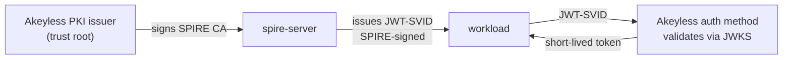

# Production hardening

The quick start is a self-contained dev demo. These are the changes that make
it production-ready.

## Trust root: Akeyless as upstream authority

The demo self-signs the SPIRE CA in a Docker volume. In production, make
Akeyless the upstream authority so it signs and rotates SPIRE's CA.

Akeyless signs the trust-root CA, but JWT-SVIDs stay signed by SPIRE's own key,
so the JWT-to-Akeyless flow works the same whether the CA is self-signed or
Akeyless-issued. Setup notes:

- The plugin's `akeyless_gateway_url` must include the API path, for example
  `https://your-gateway/api/v2`. The auth endpoint is `/api/v2/auth`; without
  the path the call hits the wrong endpoint.
- If your gateway uses a self-signed or internal CA, set `custom_ca_bundle` to
  a file with that CA cert. The plugin verifies TLS strictly.
- The PKI certificate issuer's `allowed-uri-sans` must include the trust-domain
  root itself, for example `spiffe://example.org`, not only
  `spiffe://example.org/*`. SPIRE's CA carries the root URI SAN, and the
  wildcard alone does not match it.

## Bundle distribution

The bootstrap inlines the JWKS into the auth method, which suits a fixed dev
trust domain. For production, set `SPIRE_BUNDLE_ENDPOINT` to a public bundle
endpoint so Akeyless tracks key rotation automatically and you do not need to
re-run the bootstrap after each rotation.

## Workload selectors

The demo registers by `unix:uid:0`, which is broad. In production use a
dedicated UID, a process-path selector, or the docker workload attestor with
image or label selectors so only the intended workload can obtain an SVID.

## Agent bootstrap

The dev agent sets `insecure_bootstrap = true` because the demo self-signs its
trust root. Never set this against a production trust domain. Distribute the
server bundle and bootstrap over TLS.

## Security model and limitations

- No credential is written to disk. The SVID exists only in memory for the call.
- The SVID is short-lived and audience-bound. A captured SVID is useless after
  expiry, and replaying it after expiry fails and is recorded in the Akeyless
  audit log.
- The workload's authority comes from the Akeyless role bound to its SPIFFE ID,
  not from the SVID itself. Compromise of the SPIRE server or its registration
  policy compromises every workload it attests.
- A compromised host is not stopped in real time. An attacker running code as
  the workload's UID can fetch valid SVIDs and secrets for as long as they hold
  that position. The defense is detection and revocation, which the short SVID
  lifetime and audit log make possible.
