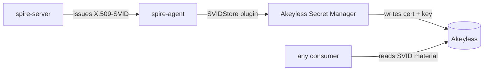

# X.509-SVID via Akeyless Secret Manager

The JWT-SVID workload reads a secret from Akeyless. The X.509-SVID workload
goes the other direction: Akeyless stores its identity material automatically.

When SPIRE issues an X.509-SVID to the registered workload, the Akeyless Secret
Manager plugin (an agent-side SVIDStore plugin) writes the certificate, private
key, and trust bundle into Akeyless as a secret. No application code is needed.
The SVID material is available in Akeyless for any consumer: a Kubernetes
sidecar injector, an external service, or a CI pipeline.

## How it works



The `up.sh` script registers the X.509 workload with `-storeSVID`, which tells
SPIRE to push the SVID to the Secret Manager plugin on the agent. The plugin
authenticates to Akeyless with `SVID_STORE_ACCESS_ID` and writes the SVID
material to the `SVID_STORE_TARGET_FOLDER` path.

## The two SVID paths compared

| | JWT-SVID (workload 1) | X.509-SVID (workload 2) |
|---|---|---|
| Who fetches | the workload, from the Workload API | SPIRE, pushed automatically |
| Where it goes | in memory, used for the call, discarded | stored in Akeyless as a secret |
| What the workload does | trades the SVID for an Akeyless token, reads a secret | nothing; the plugin handles everything |
| Best for | authenticating to Akeyless to read secrets | distributing identity material to consumers |

## Verify the X.509-SVID was stored

After `up.sh` completes (which registers the X.509 workload with `-storeSVID`),
check that the SVID material appeared in Akeyless:

```bash
GATEWAY="${AKEYLESS_GATEWAY%/}"
curl -s -X POST "$GATEWAY/api/v2/get-secret-value" \
  -H "Content-Type: application/json" \
  -d "{\"names\":[\"$SVID_STORE_TARGET_FOLDER/x509-workload-svid\"],\"token\":\"$AKEYLESS_TOKEN\"}"
```

The response contains the X.509-SVID certificate chain and private key, stored
as a secret in Akeyless.

## What the plugin needs

The Secret Manager plugin authenticates to Akeyless with its own credentials,
separate from the workload and the bootstrap. See
[Prerequisites](02-prerequisites.md#creating-the-upstreamauthority-credentials)
for the pattern; the Secret Manager auth method needs the same access-type
options (api_key, aws_iam, gcp, azure).

The plugin's role needs `create`, `update`, and `list` on the target folder
path (`SVID_STORE_TARGET_FOLDER`). The bootstrap creates this role and auth
method automatically.

## The three Akeyless SPIRE integrations

| Integration | What it does | This repo |
|---|---|---|
| [Upstream Authority](https://docs.akeyless.io/docs/spire-upstream-authority) | Signs the trust root via Akeyless PKI; manages JWT-SVID key rotation | Uses it |
| [Secret Manager](https://docs.akeyless.io/docs/spire-secret-manager) | Stores X.509-SVIDs in Akeyless automatically (this guide) | Uses it |
| [Upstream Authority SM](https://docs.akeyless.io/docs/spire-upstream-authority-sm) | Sources the CA from a stored certificate item; no JWT-SVID support | Does not use (we need JWT-SVID) |

Next: [Operations and observability](10-operations.md)
